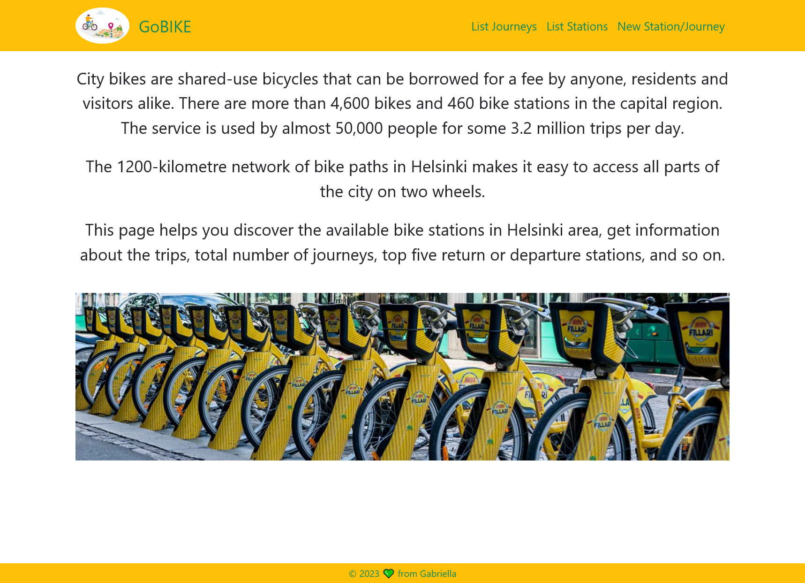

This app list the Bike stations in Helsinki area and the bike journeys between 1 May and 30 June 2021.

Platform: Windows
Backend: Node.js, Express, TypeScript
Frontend: React.js with TypeScript, Bootstrap, Mapbox SDK
Database: MongoDB Atlas. I could upload only the journey data from May and June, and the station data, because of the limit of free storage size (512MB) in MongoDB Atlas.
Test: Jest, React Testing Library

---

Download and install the packages:
Download the files from github, then install the packages at the frontend and at the backend.
First at the root folder run the command: npm install, then enter the backend folder, and also run 'npm install' command.
Backend runs on port 8000, frontend runs on port 3000. Both starts with 'npm start' command.

---

Upload the data to MongoDB Atlas:
In backend folder there is an empty .env file: insert your own MONGO_URI string and Mapbox token to the file.
Put the .csv files about journey data of May and June (or if you have more storage size then 512MB, also July) into folder backend/database/data (station.csv is already there). In the terminal enter backend folder and run the following command: npm db-start or npx ts-node database/readJourneys.ts
The function will check the csv files in data folder and create a database named 'gobike' with two collections: 'stations' and 'journeys'. Then it uploads the data from the files to MongoDB.

---

Features:

- home page: short summary about City Bikes in Helsinki and navigation
- List Journeys: list all journeys in May and June, with pagination (20 items per page), search functionality by departure or return station name
- List Stations: list all stations, with pagination (20 items per page), search functionality by station name, city name and address, sort the stations by ID, name, city, address and capacity ascending and descending order
- Single station view: shown by clicking the ID of the station in list view, returns the station name, address, location on the map, statistics about total journeys, average distance and duration of journeys, top 5 return and departure stations, recalculate the data by adding new time period between 01 May and 30 June
- Add new station or journey: add new station with non-existing ID, new journey between existing stations, clear the form or cancel the task

---

Running tests:

- backend test: enter backend folder, 'npm test' will runt all tests from test folder
- frontend test: in terminal run 'npm test' command, that will run all tests from src/**tests** folder (tests are the same name as the components that they are testing)

